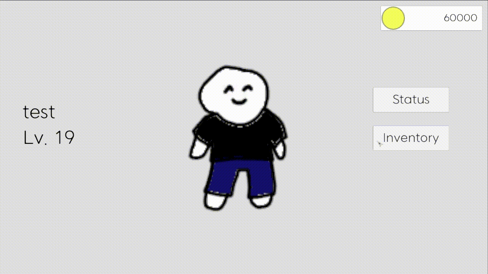

# 스파르타 내일배움캠프 유니티 11기 8주차 Inventory

 
  
   

 

## 프로젝트 소개

## 기술 스택

| C# | .Net | Unity |
| :--------: | :--------: | :--------: |
|   ![csharp]    |   ![dotnet]    |   ![unity]    |

 

## 구현 기능

- [x] UI 구성
- [x] 스크립트 생성
- [x] UI 간 전환 기능
- [x] 캐릭터 정보 세팅
- [x] UISlot 동적 생성
- [x] Item 데이터 준비
- [x] 아이템 장착
- [x] Status에 아이템 정보 반영

 

## 배운 점 & 아쉬운 점

스크롤 뷰와 동적 생성에 익숙해짐.

 

## 개발 일지

### 소요 기간 : 1일

## 라이센스

MIT &copy; [LeeHyerim](mailto:hyerimlee4426@gmail.com)

<!-- Stack Icon Refernces -->

[csharp]: /Images/Csharp.png
[dotnet]: /Images/Dotnet.png
[unity]: /Images/Unity.png

